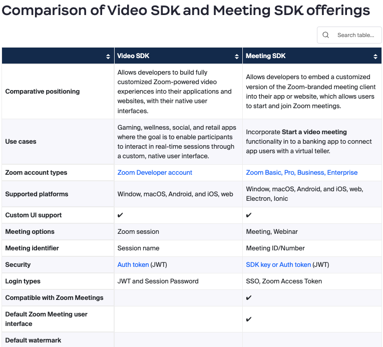
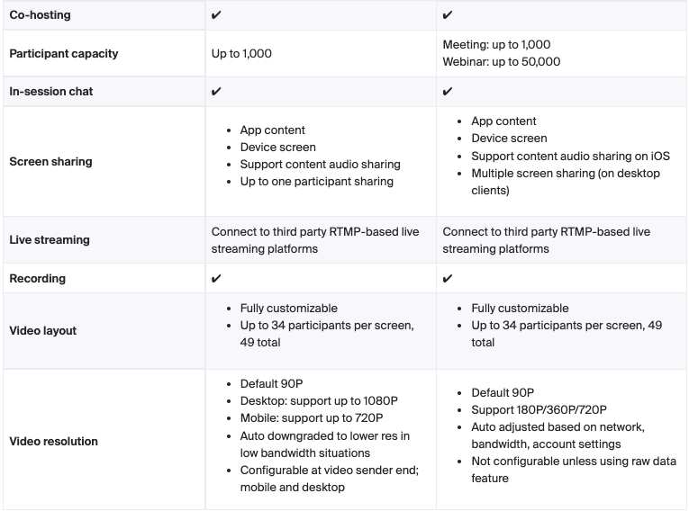
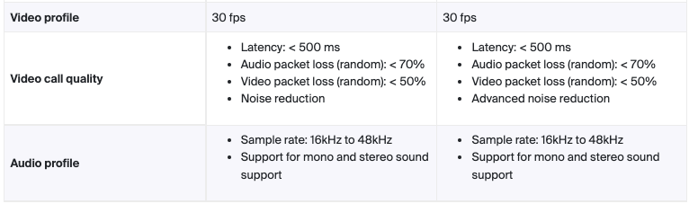
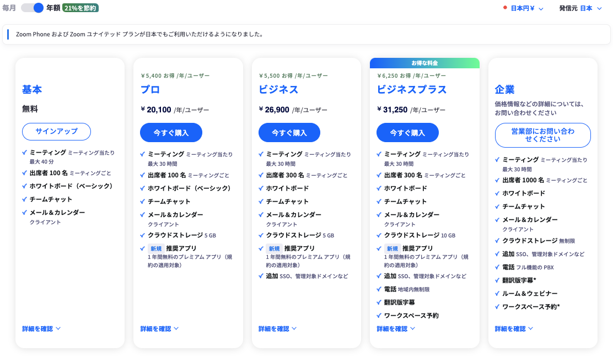

# 遠隔リハとウェブアプリの連携についての調査

> 遠隔リハのウェブアプリとZoomとのUI連携

- アプリやウェブサービスの中に埋め込むことができる，Meeting SDK, Video SDK にてできる模様  
[Video SDK と Meeting SDK](#video-sdk-と-meeting-sdk)  
[Zoom Video SDK](#4-zoom-video-sdk)  
[Zoom Meeting SDK](#5-zoom-meeting-sdk)  

> 録画データのハンドリング

- 録画は，ローカル保存（無料プラン/有料プラン），クラウド保存が可能（有料プラン）  
[Zoomプランと料金](#2-zoom-プランと料金)
- Video SDK, Meeting SDK を使ったクラウドレコーディングが可能
- 録画データの編集は，クラウドレコーディングはZoom内で編集可能．または，ダウンロードして動画編集ソフトを使用．
- クラウドレコーディングの録画データを共有可能
- **録画データの自動編集について，Zoom内で実行する方法は現時点で見つけることができませんでした**  
　→ 他のサービスやソフトウェアなど使った方法がないかも含めて，引き続き調査中です．  
[クラウドレコーディング](#3-クラウドレコーディング)
  
  
以下は，詳細情報と参考サイトです．
  
---
  
# 1. Zoom のレコーディングとクラウドへのアップロード機能について

有料登録者向けとDeveloper向けSDK/API でできること（2022年11月28日報告済，2023年6月27日更新）

## **Zoomの有料登録者向け：クラウドレコーディング**

- [クラウドレコーディング](https://support.zoom.us/hc/ja/articles/203741855-%E3%82%AF%E3%83%A9%E3%82%A6%E3%83%89-%E3%83%AC%E3%82%B3%E3%83%BC%E3%83%87%E3%82%A3%E3%83%B3%E3%82%B0%E3%81%AE%E9%96%8B%E5%A7%8B)
    - Windows, macOS, Linux, Android, iOS 環境で利用可
    - クラウドに保存されるレコーディングファイルは，ダウンロードするか，ブラウザからストリーミングすることができる
    - 保存先URLでのデータ共有が可能で，メールやYouTubeで共有できる
    - ローカルレコーディングも可能（無料プランでも利用可）  
    参考：[Zoomのクラウドレコーディングの使い方 / ローカルレコーディングの比較](https://makefri.jp/event/11640/)

## **Video SDK と Meeting SDK**

- Video SDK と Meeting SDK の比較  
[詳細はこちら](https://support.zoom.us/hc/en-us/articles/360058998832-Video-SDK-and-Meeting-SDK-comparison)

- [Meeting SDK と Video SDK について](https://qiita.com/kensano/items/937fcbae7c5c30807be1)
  - [Meeting SDK](https://marketplace.zoom.us/docs/sdk/native-sdks/introduction/) : アプリやウェブサービスの中にZoom Meeting (もしくはZoom Webinars) を埋め込むことができる  
    参考：[Zoom Meeting SDKでWebシステムにZoomを埋め込む話](https://tech.briswell.com/entry/2023/03/03/143302)
  - [Video SDK](https://marketplace.zoom.us/docs/sdk/video/introduction/) : アプリやウェブサービスにビデオ通話の機能を埋め込むことができる  
    参考：[Zoomの拡張機能！？シームレス連携が出来るAPIとSDKについて中の人に聞いてみた](https://zine.qiita.com/interview/202205-zoom/)
 

-  **Zoom Video SDK for Recording**  
  - [Cloud recording](https://marketplace.zoom.us/docs/sdk/video/web/essential/recording/) APIs to enable Developers to initiate and manage cloud recording functions. REST-API, 録画の最大解像度は720p, 有料で月額100ドル（1TBのクラウドストレージを含み超過料金0.5ドル/GB, 3万分のComposedRecordingMinutesを含み超過料金0.015ドル/分）
  - [GitHub : videosdk-web](https://github.com/zoom/videosdk-web)
 

- **各SDK/API の説明や実装について**  
   [こちらのWebサイト](https://qiita.com/kensano/items/4e43f229e96bffe51677)の動画が参考になると思います．

---

（2023年6月29日新規）

# 2. Zoom プランと料金
  

[詳細はこちら](https://zoom.us/ja/pricing)
 

- **有料アカウントのメリット**  
  - 40分以上の会議でも時間制限を受けない
  - クラウドレコーディングが利用できる
  - 他のビジネスアプリと連携できる
  - 共同ホストを設定できる
  - ユーザーの管理機能が充実する
  - パーソナルミーティングIDを変更できる

# 3. クラウドレコーディング

## クラウドレコーディングについて  
[Zoom サポート : クラウドレコーディングの開始](https://support.zoom.us/hc/en-us/articles/203741855)
 

- **特徴**  
  - クラウドレコーディングに対応したZoom有料ライセンスのアカウントが必要
  - クラウドレコーディングされた録画データ(MP4形式)
  - ZoomのWebサイト内でトリミング編集可
  - クラウド録画した動画の文字起こし生成・編集，字幕表示，再生速度変更を利用可
 

- **利用条件**
  - プロ、ビジネス、エンタープライズ アカウント
  - ライセンス　ユーザー
  - Zoom デスクトップ クライアント
    - Windows: 3.5 以降
    - macOS: 3.5 以降
    - Linux: 3.5 以降
  - Zoom モバイルアプリ:
    - Android: 3.5 以降
    - iOS: 3.5 以降
  - クラウド レコーディングが有効
  - 必要に応じて選択したクラウド レコーディング設定
 

- **クラウドレコーディングで録画した動画を編集する方法**  
  Zoom内で編集できるのはクラウドレコーディングされたファイルのみ  
    参考：[Zoomの録画した動画ファイルを編集する方法を解説](https://symphonict.nesic.co.jp/workingstyle/zoom/edit-recording/)
 

- クラウドレコーディングが使えない場合，Zoomの録画ファイルはPCのローカルに保存されるので，動画編集ソフトを使って編集可能
 

- **管理と共有**  
[Zoom サポート : クラウドレコーディングの管理と共有](https://support.zoom.us/hc/en-us/articles/205347605)  
  - アカウントオーナーと管理者は，クラウドレコーディングを管理することが可能
  - クラウドレコーディングの共有，ダウンロード

# 4. Zoom Video SDK

[Zoom developers : Zoom Video SDK](https://developers.zoom.us/docs/video-sdk/)

- Zoom Video SDKでアプリやウェブサービスにビデオ通話の機能を埋め込むことが可能
- 通常のZoom MeetingやZoom Webinarsとは互換性なし（接続不可）
- 標準のUI/UXが提供なし．画面レイアウトなどを設計する必要あり（JumpstartでWeb SDKにはひな形を提供）
- チャットやブレイクアウトルームなどのビデオ通話以外の機能は原則的に提供されない
- Web Video SDKはChrome, Safariなどデスクトップとモバイルの主要ブラウザをサポート  
 

- **Platforms**
    - iOS
    - Android
    - macOS
    - Windows
    - Web
    - React Native
    - Linux
    - Flutter
 

- **Developer accounts**
  Video SDK を使用するには，Zoom Video SDK account を作成する
  Zoom Video SDK アカウント は，Zoom ユーザアカウントとは異なるアカウントタイプであり，Zoom ユーザアカウントと組み合わせができない
  Zoom ユーザアカウントを持っている場合，Zoom Vide SDK アカウントのメールアドレスは異なるものでなければならない

    [Zoom Video SDK account を作成する](https://zoom.us/buy/videosdk)
 

- **SDK Sample (Github : Zoom)**
  - [Zoom Video SDK web sample](https://github.com/zoom/videosdk-web-sample)  
  The Zoom Video SDK for web enables you to build custom video experiences on a webpage with Zoom's core technology through a highly optimized WebAssembly modul
  - [Zoom Video SDK for Web](https://github.com/zoom/videosdk-web)  
  The Zoom Video SDK enables you to build custom video experiences with Zoom's core technology through a highly optimized WebAssembly module.
  - [Zoom Webhook sample](https://github.com/zoom/webhook-sample)  
  This is a Node.js / Express server that receives Zoom Platform Webhooks and Zoom Video SDK Webhooks.
 

- **How to (Qiita : Zoom Japan)**
  - [はじめての Zoom Video SDK - 準備編](https://qiita.com/yosuke-sawamura/items/72df3bd91a6319ccc35c)
  - [はじめての Zoom Video SDK for Web - 実装編](https://qiita.com/yosuke-sawamura/items/3efae5d08254e981e13b)
  - [はじめての Zoom Webhook](https://qiita.com/yosuke-sawamura/items/a45453f1492a43211b96)

# 5. Zoom Meeting SDK

[Zoom developers : Zoom Meeting SDK](https://developers.zoom.us/docs/meeting-sdk/)

- Zoom Meeting SDKでアプリやウェブサービスにZoom Meeting(もしくはZoom Webinars)を埋め込むことが可能
- 通常のZoom MeetingやZoom Webinarsと互換性があるので通常のZoomクライアントアプリと接続することも可能
- 標準のUI/UXの提供あり．UI/UXのカスタマイズはほとんどできない
- チャットやブレイクアウトルーム，クラウド録画など通常のZoom MeetingやZoom Webinarsで提供されている機能の大半が利用可能
- Web Video SDKはChrome, Safariなどデスクトップとモバイルの主要ブラウザをサポート
- 社内利用（Zoom Meeting/Webinarsの 参加者全員が契約企業に所属している場合 ）であれば有償のZoomライセンスの契約があれば利用可能
- 第三者利用（Zoom Meeting/Webinarsの ホストまたは参加者が契約企業に所属していない場合 ）になる場合、Zoom ISVパートナープラグラムに参加するか、Zoom App Marketplaceに登録
 

- **Platforms**
  - iOS
  - Android
  - macOS
  - Windows
  - Web
  - Electron
 

- **Developer accounts**
  Meeting SDK を使用するには，Zoom user account を作成する
  既存のZoom ユーザアカウントを使用することも，新しいアカウントを作成することも可能

    [Zoom user account を作成する](https://zoom.us/signup)
 

- **SDK Sample (Github : Zoom)**
  - [Zoom Meeting SDK web sample](https://github.com/zoom/meetingsdk-web-sample)  
  The Zoom Meeting SDK for web embeds the Zoom Meeting and Zoom Webinar experiences on a webpage through a highly optimized WebAssembly module.
  - [Zoom Meeting SDK for Web](https://github.com/zoom/meetingsdk-web)  
  The Zoom Meeting SDK embeds the Zoom Meeting and Webinar experience in a website through a highly optimized WebAssembly module.
 

- **How to (Qiita : Zoom Japan)**
  - [はじめての Zoom Meeting SDK - 準備編](https://qiita.com/yosuke-sawamura/items/de69e73e47335cd61d68)
  - [はじめての Zoom Meeting SDK - Web (Client view)編](https://qiita.com/yosuke-sawamura/items/df6eb3b4bc2f11ba281f)
  - [はじめての Zoom Meeting SDK - Web (Component view)編](https://qiita.com/yosuke-sawamura/items/dfb1e862c8882e5afb58)

# 6. 参考サイト

- [zoom developers](https://developers.zoom.us/docs/)
- [Qiita Zoom Japan](https://qiita.com/organizations/zvc)
- [GitHub Zoom](https://github.com/zoom)
